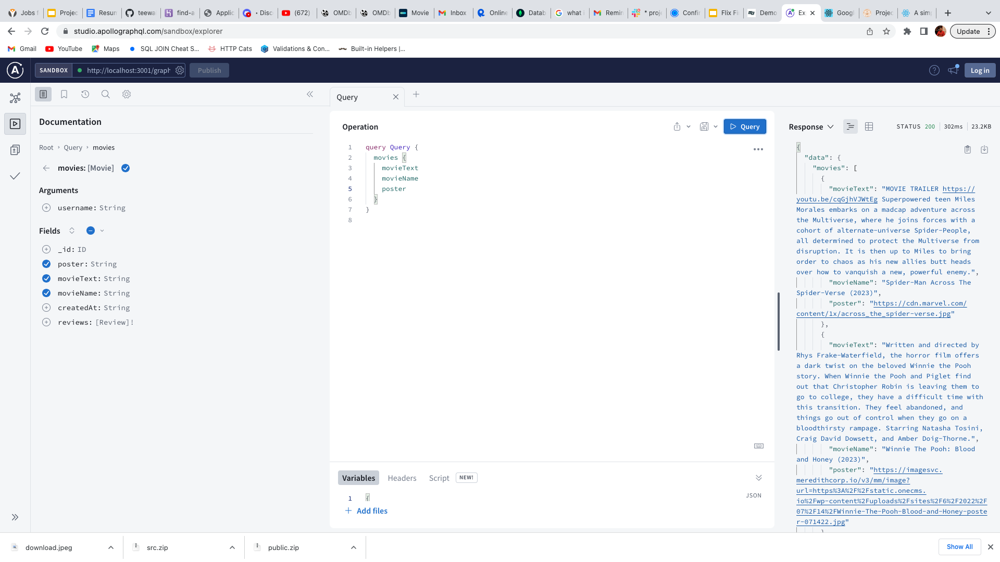
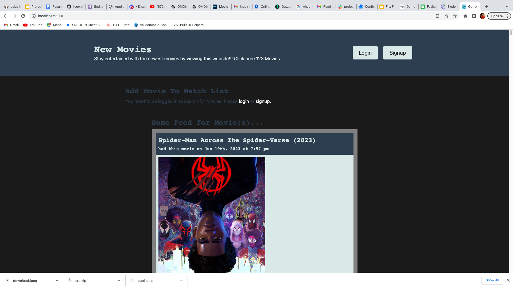

# Find-a-Flix

## Description

As a group we were highly motivated to complete this project because this is our first Full-Stack MERN appliction we have ever created. We built this project because we wanted to build an application for the user to search and find Movies and shows to watch, add to a watch list and be directed to a website where the user can view the movie. This appliction will help users find new entertainment, keep track of movies they want to watch by adding to watch list, view movie previews, see movie ratings, and make it easier for them to watch them to find the movie. Building this website helped us learn more about MERN, React, new dependices, and teamwork.

## Table of Contents (Optional)

If your README is long, add a table of contents to make it easy for users to find what they need.

- [Installation](#installation)
- [Usage](#usage)
- [Credits](#credits)
- [License](#license)
- [Website](#website)

## Installation

Steps required to install this project. Download concurrently, package json, babel/plugin-proposal-private-property-in-object, graphql, jwt-decode, and node.

## Usage

Signup for website by clicking signup. After being logged in you'll be able to search for moives to watch. Once user has found movie user will be able to see the movies rating and watch a video trailer. User will be able to save movies to a watch list if its something the user is interested in. Once user is ready to watch the movie the user will be able to see a webpage that has the movie availible for them to watch!

## Credits

List of collaborators with links to our GitHub profiles.

Tevin Walker: https://github.com/teewalk32

Dewayne Cavendish: https://github.com/RockyluvsEmily

Terrell Whiting: https://github.com/grittyByt

Tutorials with included links!

lesson 26 from MERN class activites for website structure. Tevin

https://stackoverflow.com/questions/44154939/load-local-images-in-react-js Tevin

## License

MIT License

## How to Contribute

No contributes needed for this project.

## Website

hhttps://find-a-flix-d1af28d73e3d.herokuapp.com/

